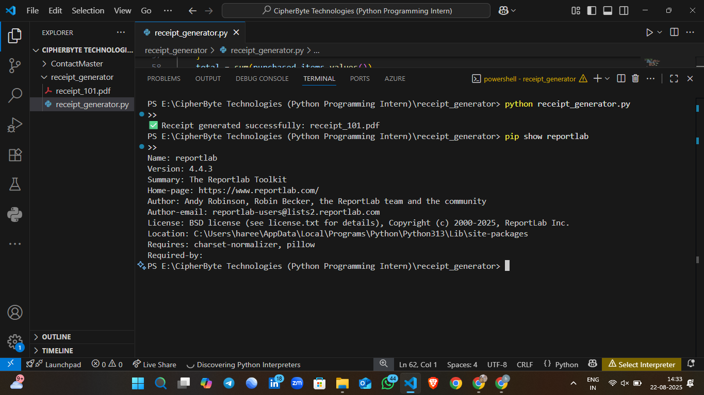
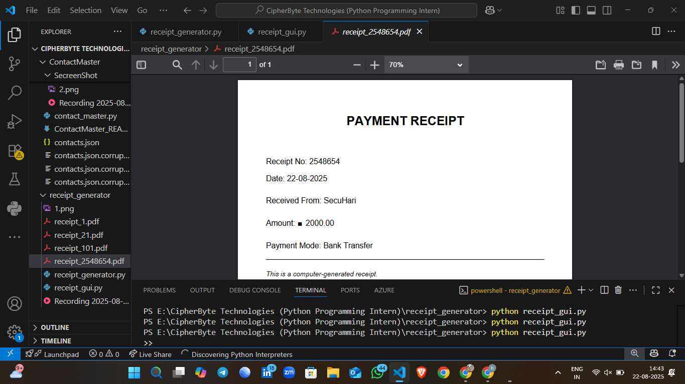

# 💳 Task 2 - Payment Receipt Generator (GUI Based)
Developed during my **Python Programming Internship at CipherByte Technologies**.

A Python-based **Payment Receipt Generator** with a user-friendly **Tkinter GUI**.  
This tool helps generate professional PDF receipts quickly and efficiently.

---

## 🚀 Features
- GUI-based interface (built with **Tkinter**).
- Enter customer details (Name, Amount, Payment Method, Description).
- Auto-generates **PDF receipts** using **ReportLab**.
- Neat and professional receipt design.
- Fast and portable – no need for heavy applications like MS Word or Excel.
- Perfect for **freelancers, small businesses, or internship projects**.

---

## 🛠️ Tech Stack
- **Python 3.x**
- **Tkinter** (GUI)
- **ReportLab** (PDF generation)
- **Pillow** (for image/logo support if needed)

---

## 📂 Project Structure
```
receipt_generator/
│
├── receipt_gui.py          # Main GUI application
├── requirements.txt        # Dependencies
├── generated_receipts/     # (Auto-created) Stores all receipts
└── README.md               # Project Documentation
```

---

## ⚙️ Installation & Setup
1. Clone the repository:
   ```bash
   git clone https://github.com/<your-username>/receipt-generator.git
   cd receipt-generator
   ```

2. Install required dependencies:
   ```bash
   pip install -r requirements.txt
   ```

3. Run the app:
   ```bash
   python receipt_gui.py
   ```

---

## 📸 Screenshots

### GUI Interface


### Sample Receipt


---

## 🎯 Use Cases
- Freelancers creating receipts for clients.
- Small businesses to maintain simple payment records.
- Students/interns to demonstrate Python GUI & PDF automation skills.

---

## 🤝 Internship Note
This project was developed as part of my **Python Programming Internship (Task 2)** at **CipherByte Technologies**.  
It showcases my skills in **Python, GUI development, and PDF automation**.

---

## 🔗 Connect with Me
👤 [Hareesh Kumar (LinkedIn)](https://www.linkedin.com/in/hareesh-kumar-02045a339/)

---

## 📌 Tags
`#Python` `#GUI` `#ReportLab` `#Tkinter` `#Internship` `#CipherByteTechnologies` `#Project`
